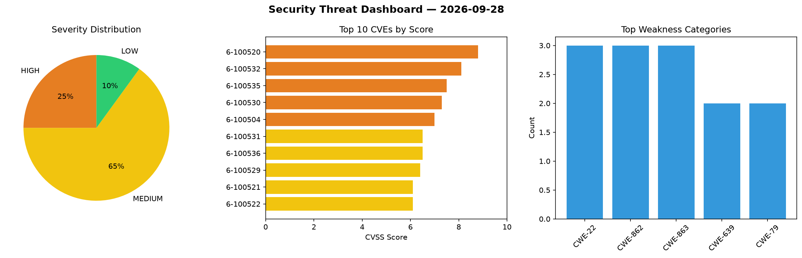
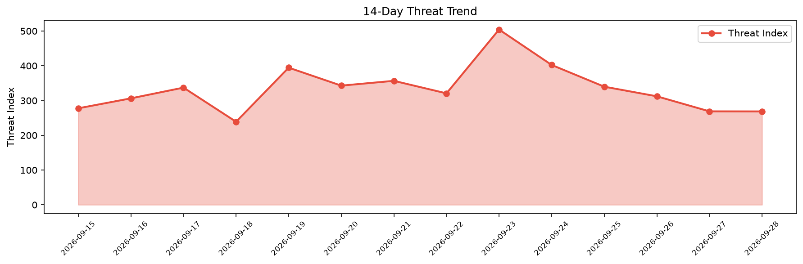

# Security Scan Report — 2026-09-28

**Scan ID:** `4d69465114` | **CVEs:** 20 | **Threat Index:** 268.7

## Threat Overview

| Metric | Value |
|--------|-------|
| Threat Index | 268.7 |
| Critical CVEs | 0 |
| HIGH | 5 |
| MEDIUM | 13 |
| LOW | 2 |

## Delta vs Yesterday

| Metric | Today | Yesterday | Change |
|--------|-------|-----------|--------|
| total_cves | 20 | 20 | ➡️ 0.0% |
| threat_index | 268.7 | 268.9 | 📉 -0.1% |
| critical_count | 0 | 2 | 📉 -100.0% |

## Top Weakness Categories

| CWE | Count |
|-----|-------|
| CWE-22 | 3 |
| CWE-862 | 3 |
| CWE-863 | 3 |
| CWE-639 | 2 |
| CWE-79 | 2 |

## CVE Details

| CVE ID | Score | Severity | Description |
|--------|-------|----------|-------------|
| CVE-2026-100520 | 8.8 | HIGH | Laranode versions before 1.2.1 contain a path traversal vulnerability in the POS... |
| CVE-2026-100532 | 8.1 | HIGH | @openclaw/whatsapp (npm) before 2026.8.1 exposes the WhatsApp login tool through... |
| CVE-2026-100535 | 7.5 | HIGH | OpenClaw (npm package 'openclaw') versions >= 2026.4.5 and < 2026.8.1 can lose t... |
| CVE-2026-100530 | 7.3 | HIGH | OpenClaw versions before 2026.8.1 fail to bind working directory context to reus... |
| CVE-2026-100504 | 7.0 | HIGH | Ghidra versions through 12.1.4 contain a stack-based out-of-bounds write vulnera... |
| CVE-2026-100531 | 6.5 | MEDIUM | The @openclaw/slack npm package before 2026.8.1 contains an authorization flaw i... |
| CVE-2026-100536 | 6.5 | MEDIUM | OpenClaw versions before 2026.8.1 fail to validate all source fields in structur... |
| CVE-2026-100529 | 6.4 | MEDIUM | OpenClaw versions before 2026.8.1 contain an authorization scope widening vulner... |
| CVE-2026-100521 | 6.1 | MEDIUM | Cotonti through 1.0.0 contains a reflected cross-site scripting vulnerability in... |
| CVE-2026-100522 | 6.1 | MEDIUM | Cotonti through 1.0.0 contains a reflected cross-site scripting vulnerability in... |
| CVE-2026-100523 | 6.1 | MEDIUM | Cotonti through 1.0.0 contains an open redirect vulnerability in message.php tha... |
| CVE-2026-100524 | 5.4 | MEDIUM | Cotonti through 1.0.0 contains a cross-site request forgery vulnerability in the... |
| CVE-2026-100528 | 5.4 | MEDIUM | OpenClaw (npm package 'openclaw') before 2026.8.1 could send third-party provide... |
| CVE-2026-100526 | 5.3 | MEDIUM | OpenClaw's Discord integration (npm package @openclaw/discord) before version 20... |
| CVE-2026-100527 | 5.3 | MEDIUM | OpenClaw before 2026.8.2 contains a denial of service vulnerability in the Brows... |