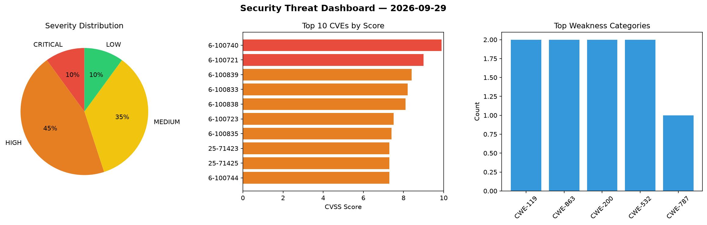
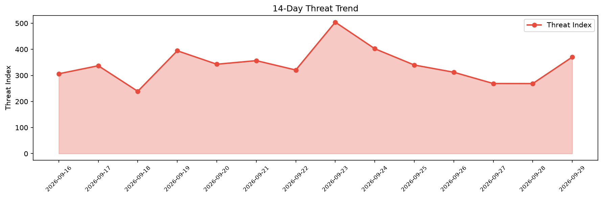

# Security Scan Report — 2026-09-29

**Scan ID:** `1c9e6199a1` | **CVEs:** 20 | **Threat Index:** 370.4

## Threat Overview

| Metric | Value |
|--------|-------|
| Threat Index | 370.4 |
| Critical CVEs | 2 |
| CRITICAL | 2 |
| HIGH | 9 |
| MEDIUM | 7 |
| LOW | 2 |

## Delta vs Yesterday

| Metric | Today | Yesterday | Change |
|--------|-------|-----------|--------|
| total_cves | 20 | 20 | ➡️ 0.0% |
| threat_index | 370.4 | 268.7 | 📈 37.8% |
| critical_count | 2 | 0 | ➡️ 0% |

## Top Weakness Categories

| CWE | Count |
|-----|-------|
| CWE-119 | 2 |
| CWE-863 | 2 |
| CWE-200 | 2 |
| CWE-532 | 2 |
| CWE-787 | 1 |

## CVE Details

| CVE ID | Score | Severity | Description |
|--------|-------|----------|-------------|
| CVE-2026-100740 | 9.9 | CRITICAL | A vulnerability was detected in D-Link DIR-895L A1_102b07. Impacted is the funct... |
| CVE-2026-100721 | 9.0 | CRITICAL | vm2 before 3.12.2 contains an authorization bypass in the NodeVM external-module... |
| CVE-2026-100839 | 8.4 | HIGH | Contrast is a confidential-computing runtime for Kubernetes. In versions before ... |
| CVE-2026-100833 | 8.2 | HIGH | Contrast (edgelesssys/contrast) versions 1.14.0 before 1.23.1 generate runtime p... |
| CVE-2026-100838 | 8.1 | HIGH | Contrast is a confidential-computing runtime for Kubernetes. In versions before ... |
| CVE-2026-100723 | 7.5 | HIGH | vm2 before 3.12.2 does not apply its Buffer backing-store ownership invariant (b... |
| CVE-2026-100835 | 7.4 | HIGH | Contrast before 1.16.0 is susceptible to remote attestation relay attacks. Contr... |
| CVE-2025-71423 | 7.3 | HIGH | Edgelesssys Contrast is a confidential-computing runtime for Kubernetes. In vers... |
| CVE-2025-71425 | 7.3 | HIGH | Contrast (Edgeless Systems) before 1.8.1 logs the workload secret to stderr, and... |
| CVE-2026-100744 | 7.3 | HIGH | A flaw has been found in coollabsio Coolify up to 4.1.2. The affected element is... |
| CVE-2025-71426 | 7.1 | HIGH | Contrast is a confidential-computing runtime for Kubernetes. In versions before ... |
| CVE-2026-100722 | 6.8 | MEDIUM | vm2 before 3.12.2 does not apply host-side Promise rejection handling in the san... |
| CVE-2026-100725 | 6.5 | MEDIUM | http4k (Maven artifact org.http4k:http4k-core) before 6.48.0.0, 5.42.0.0, and 4.... |
| CVE-2026-100745 | 6.3 | MEDIUM | A vulnerability has been found in Edimax BR-6428nC 1.16. The impacted element is... |
| CVE-2026-100834 | 5.9 | MEDIUM | http4k's Digest authentication module (org.http4k:http4k-security-digest) before... |