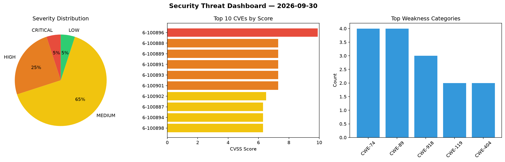
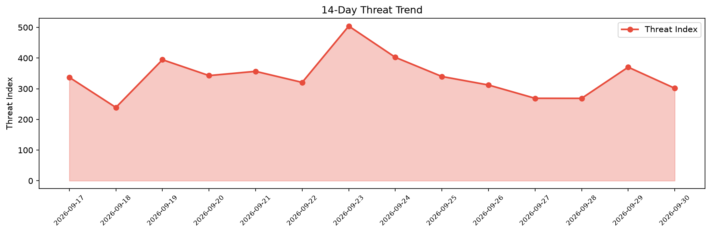

# Security Scan Report — 2026-09-30

**Scan ID:** `2ec6ad572d` | **CVEs:** 20 | **Threat Index:** 301.6

## Threat Overview

| Metric | Value |
|--------|-------|
| Threat Index | 301.6 |
| Critical CVEs | 1 |
| CRITICAL | 1 |
| HIGH | 5 |
| MEDIUM | 13 |
| LOW | 1 |

## Delta vs Yesterday

| Metric | Today | Yesterday | Change |
|--------|-------|-----------|--------|
| total_cves | 20 | 20 | ➡️ 0.0% |
| threat_index | 301.6 | 370.4 | 📉 -18.6% |
| critical_count | 1 | 2 | 📉 -50.0% |

## Top Weakness Categories

| CWE | Count |
|-----|-------|
| CWE-74 | 4 |
| CWE-89 | 4 |
| CWE-918 | 3 |
| CWE-119 | 2 |
| CWE-404 | 2 |

## CVE Details

| CVE ID | Score | Severity | Description |
|--------|-------|----------|-------------|
| CVE-2026-100896 | 9.9 | CRITICAL | A weakness has been identified in TOTOLINK N150RT 3.4.0-B20201030. The affected ... |
| CVE-2026-100888 | 7.3 | HIGH | A weakness has been identified in Trusted Domain Project OpenDKIM up to 2.11.0. ... |
| CVE-2026-100889 | 7.3 | HIGH | A vulnerability was detected in Trusted Domain Project OpenDKIM up to 2.11.0. Af... |
| CVE-2026-100891 | 7.3 | HIGH | A vulnerability has been found in Trusted Domain Project OpenDMARC up to 1.4.2. ... |
| CVE-2026-100893 | 7.3 | HIGH | A vulnerability was determined in Privoce VoceChat Server up to 0.5.36. This vul... |
| CVE-2026-100901 | 7.3 | HIGH | A vulnerability was found in athlon1600 youtube-downloader up to 4.0.1. Affected... |
| CVE-2026-100902 | 6.5 | MEDIUM | A vulnerability was determined in Barco ClickShare CX-20 Gen2 up to 02.26.00.000... |
| CVE-2026-100887 | 6.3 | MEDIUM | A security flaw has been discovered in amirsanni Mini-Inventory-and-Sales-Manage... |
| CVE-2026-100894 | 6.3 | MEDIUM | A vulnerability was identified in mathurvishal CloudClassroom-PHP-Project up to ... |
| CVE-2026-100898 | 6.3 | MEDIUM | A vulnerability was detected in DevaslanPHP project-management 1.2.1/1.2.2/1.2.3... |
| CVE-2026-100899 | 6.3 | MEDIUM | A flaw has been found in DevaslanPHP project-management 1.2.1/1.2.2/1.2.3/1.2.4/... |
| CVE-2026-100897 | 5.5 | MEDIUM | A security vulnerability has been detected in fuzui StudentInfo up to fcc42a639e... |
| CVE-2026-100900 | 5.5 | MEDIUM | A vulnerability has been found in DevaslanPHP project-management 1.2.1/1.2.2/1.2... |
| CVE-2026-100890 | 5.3 | MEDIUM | A flaw has been found in Trusted Domain Project OpenDMARC up to 1.4.2. Affected ... |
| CVE-2026-100892 | 5.3 | MEDIUM | A vulnerability was found in aligungr UERANSIM up to 3.3.0. This affects the fun... |