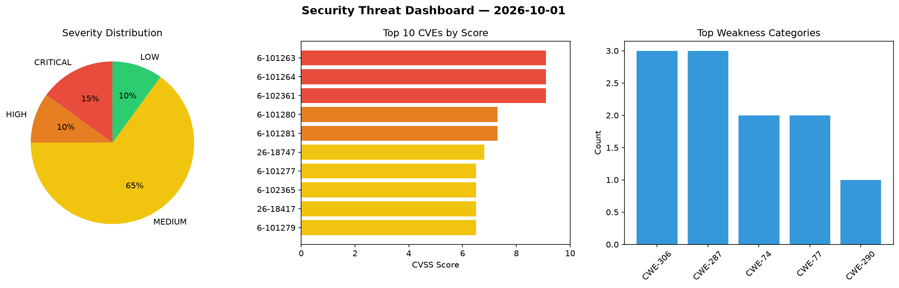
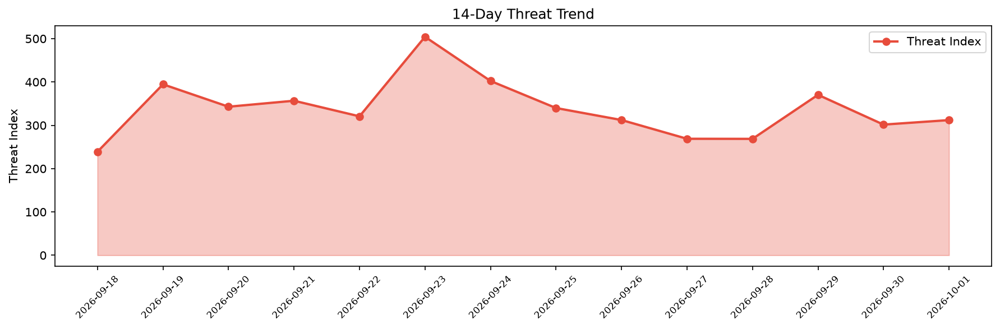

# Security Scan Report — 2026-10-01

**Scan ID:** `11c9080aef` | **CVEs:** 20 | **Threat Index:** 312.0

## Threat Overview

| Metric | Value |
|--------|-------|
| Threat Index | 312.0 |
| Critical CVEs | 3 |
| CRITICAL | 3 |
| HIGH | 2 |
| MEDIUM | 13 |
| LOW | 2 |

## Delta vs Yesterday

| Metric | Today | Yesterday | Change |
|--------|-------|-----------|--------|
| total_cves | 20 | 20 | ➡️ 0.0% |
| threat_index | 312.0 | 301.6 | 📈 3.4% |
| critical_count | 3 | 1 | 📈 200.0% |

## Top Weakness Categories

| CWE | Count |
|-----|-------|
| CWE-306 | 3 |
| CWE-287 | 3 |
| CWE-74 | 2 |
| CWE-77 | 2 |
| CWE-290 | 1 |

## CVE Details

| CVE ID | Score | Severity | Description |
|--------|-------|----------|-------------|
| CVE-2026-101263 | 9.1 | CRITICAL | A vulnerability was found in Ziroom ZHOME A0101 1.0.1.0. This issue affects some... |
| CVE-2026-101264 | 9.1 | CRITICAL | A vulnerability was determined in Ziroom ZHOME A0101 1.0.1.0. Impacted is an unk... |
| CVE-2026-102361 | 9.1 | CRITICAL | mall4j through 4.0 contains a missing authentication vulnerability in the PUT /u... |
| CVE-2026-101280 | 7.3 | HIGH | A vulnerability was detected in Trusted Domain Project OpenDMARC up to 1.4.2. Af... |
| CVE-2026-101281 | 7.3 | HIGH | A flaw has been found in Trusted Domain Project OpenDMARC up to 1.4.2. Affected ... |
| CVE-2026-18747 | 6.8 | MEDIUM | The MCUmgr SMP-over-console transport decodes a base64 frame, reads a 16-bit pac... |
| CVE-2026-101277 | 6.5 | MEDIUM | A security flaw has been discovered in Trusted Domain Project OpenDKIM up to 2.1... |
| CVE-2026-102365 | 6.5 | MEDIUM | mall4j through 4.0 fails to enforce authorization checks on GET endpoints in Use... |
| CVE-2026-18417 | 6.5 | MEDIUM | The native BSD-socket layer recorded a pending asynchronous socket error by type... |
| CVE-2026-101279 | 6.5 | MEDIUM | A security vulnerability has been detected in Trusted Domain Project OpenDMARC u... |
| CVE-2026-102373 | 6.5 | MEDIUM | GestSup versions before 3.2.62 fail to validate ticket ownership when loading co... |
| CVE-2026-102372 | 6.1 | MEDIUM | GestSup versions before 3.2.61 fail to properly sanitize HTML email bodies in th... |
| CVE-2026-18746 | 5.9 | MEDIUM | parse_write_op() in subsys/net/lib/lwm2m/lwm2m_message_handling.c handles inboun... |
| CVE-2026-102364 | 5.4 | MEDIUM | mall4j through 4.0 fails to validate the sysType field in sa-token sessions, all... |
| CVE-2026-102367 | 5.4 | MEDIUM | mall4j through 4.0 contains an insufficient session expiration vulnerability in ... |