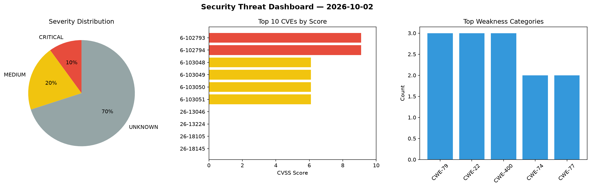
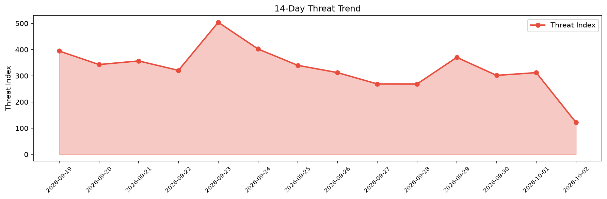

# Security Scan Report — 2026-10-02

**Scan ID:** `68704f014d` | **CVEs:** 20 | **Threat Index:** 121.6

## Threat Overview

| Metric | Value |
|--------|-------|
| Threat Index | 121.6 |
| Critical CVEs | 2 |
| CRITICAL | 2 |
| MEDIUM | 4 |
| UNKNOWN | 14 |

## Delta vs Yesterday

| Metric | Today | Yesterday | Change |
|--------|-------|-----------|--------|
| total_cves | 20 | 20 | ➡️ 0.0% |
| threat_index | 121.6 | 312.0 | 📉 -61.0% |
| critical_count | 2 | 3 | 📉 -33.3% |

## Top Weakness Categories

| CWE | Count |
|-----|-------|
| CWE-79 | 3 |
| CWE-22 | 3 |
| CWE-400 | 3 |
| CWE-74 | 2 |
| CWE-77 | 2 |

## CVE Details

| CVE ID | Score | Severity | Description |
|--------|-------|----------|-------------|
| CVE-2026-102793 | 9.1 | CRITICAL | A flaw has been found in Ziroom ZHOME A0101 1.0.1.0. This vulnerability affects ... |
| CVE-2026-102794 | 9.1 | CRITICAL | A vulnerability has been found in Ziroom ZHOME A0101 1.0.1.0. This issue affects... |
| CVE-2026-103048 | 6.1 | MEDIUM | URL redirection to untrusted site ('open redirect') vulnerability in The Wikimed... |
| CVE-2026-103049 | 6.1 | MEDIUM | Improper neutralization of input during web page generation ('cross-site scripti... |
| CVE-2026-103050 | 6.1 | MEDIUM | Improper neutralization of input during web page generation ('cross-site scripti... |
| CVE-2026-103051 | 6.1 | MEDIUM | Improper neutralization of input during web page generation ('cross-site scripti... |
| CVE-2026-13046 | 0.0 | UNKNOWN | A deserialization of untrusted data vulnerability in WatchGuard Fireware OS's SA... |
| CVE-2026-13224 | 0.0 | UNKNOWN | A path traversal vulnerability in the Fireware OS WebUI management agent allows ... |
| CVE-2026-18105 | 0.0 | UNKNOWN | An uncontrolled resource consumption vulnerability in Fireware OS's diagnostic t... |
| CVE-2026-18145 | 0.0 | UNKNOWN | A stack-based buffer overflow vulnerability in the spamBlocker (spamd) service o... |
| CVE-2026-81433 | 0.0 | UNKNOWN | A stack-based buffer overflow vulnerability in WatchGuard Fireware OS's DHCP fin... |
| CVE-2026-86101 | 0.0 | UNKNOWN | An improper authorization vulnerability in WatchGuard Fireware OS's SAML login p... |
| CVE-2026-86104 | 0.0 | UNKNOWN | An uncontrolled resource consumption vulnerability in the Fireware OS login proc... |
| CVE-2026-86105 | 0.0 | UNKNOWN | An improper authorization vulnerability in Fireware OS's Access Portal reverse p... |
| CVE-2026-86128 | 0.0 | UNKNOWN | A NULL pointer dereference vulnerability in Fireware OS's NetFlow packet-process... |