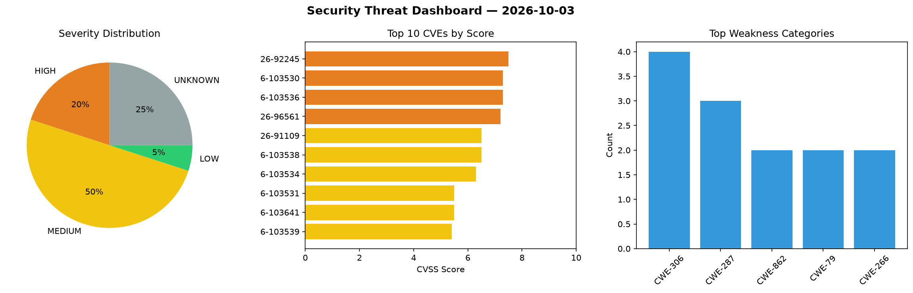
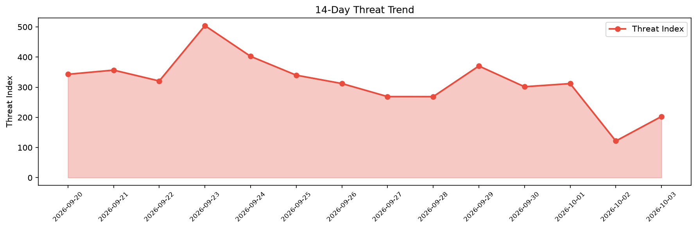

# Security Scan Report — 2026-10-03

**Scan ID:** `29cb6fd213` | **CVEs:** 20 | **Threat Index:** 203.0

## Threat Overview

| Metric | Value |
|--------|-------|
| Threat Index | 203.0 |
| Critical CVEs | 0 |
| HIGH | 4 |
| MEDIUM | 10 |
| LOW | 1 |
| UNKNOWN | 5 |

## Delta vs Yesterday

| Metric | Today | Yesterday | Change |
|--------|-------|-----------|--------|
| total_cves | 20 | 20 | ➡️ 0.0% |
| threat_index | 203.0 | 121.6 | 📈 66.9% |
| critical_count | 0 | 2 | 📉 -100.0% |

## Top Weakness Categories

| CWE | Count |
|-----|-------|
| CWE-306 | 4 |
| CWE-287 | 3 |
| CWE-862 | 2 |
| CWE-79 | 2 |
| CWE-266 | 2 |

## CVE Details

| CVE ID | Score | Severity | Description |
|--------|-------|----------|-------------|
| CVE-2026-92245 | 7.5 | HIGH | The Simply Schedule Appointments plugin for WordPress is vulnerable to Sensitive... |
| CVE-2026-103530 | 7.3 | HIGH | A vulnerability was detected in decolua 9Router up to 0.5.55. The affected eleme... |
| CVE-2026-103536 | 7.3 | HIGH | A vulnerability was identified in ZongXR Supermarket 1.0.0.0. Affected by this v... |
| CVE-2026-96561 | 7.2 | HIGH | The AI Engine – The Chatbot, AI Framework & MCP for WordPress plugin for WordPre... |
| CVE-2026-91109 | 6.5 | MEDIUM | The Simply Schedule Appointments plugin for WordPress is vulnerable to Insecure ... |
| CVE-2026-103538 | 6.5 | MEDIUM | A security flaw has been discovered in ZongXR SuperMarket 1.0.0.0. Affected by t... |
| CVE-2026-103534 | 6.3 | MEDIUM | A vulnerability was determined in David-Crty databasement up to 1.7.1. Affected ... |
| CVE-2026-103531 | 5.5 | MEDIUM | A flaw has been found in OpenSC up to 0.27.1. The impacted element is the functi... |
| CVE-2026-103641 | 5.5 | MEDIUM | A flaw was found in GEGL. The Radiance HDR loader reads past the end of a memory... |
| CVE-2026-103539 | 5.4 | MEDIUM | A weakness has been identified in ZongXR SuperMarket 1.0.0.0. This affects the f... |
| CVE-2026-12241 | 5.4 | MEDIUM | The Advanced Woo Labels – Product Labels & Badges for WooCommerce plugin for Wor... |
| CVE-2026-103532 | 5.3 | MEDIUM | A vulnerability has been found in immich-app Immich up to 2.7.5. This affects th... |
| CVE-2026-92537 | 5.3 | MEDIUM | The Newsletter – Send awesome emails from WordPress plugin for WordPress is vuln... |
| CVE-2026-103533 | 4.1 | MEDIUM | A vulnerability was found in David-Crty databasement up to 1.7.1. This impacts t... |
| CVE-2026-101887 | 3.5 | LOW | BlueALSA (bluez-alsa/bluealsad) contains a division-by-zero vulnerability in the... |