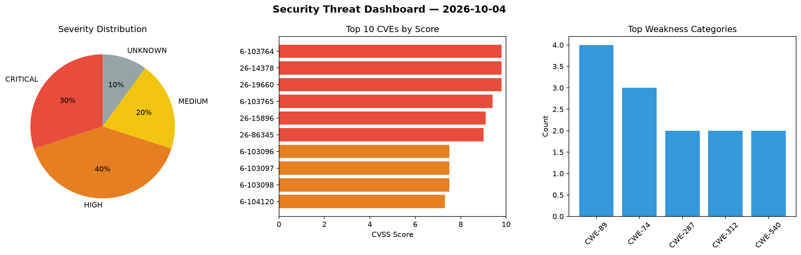
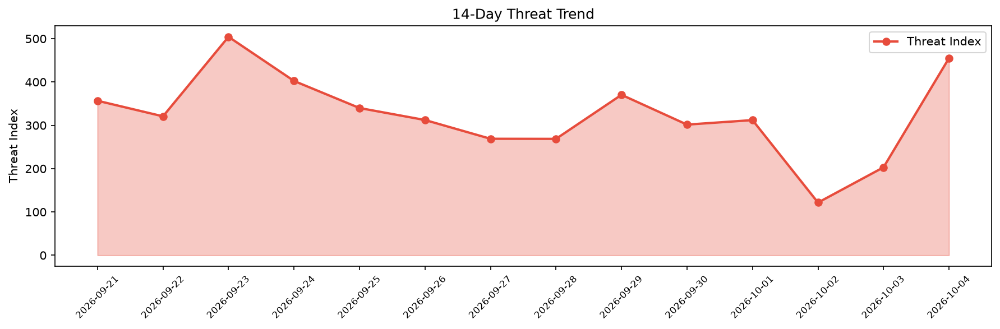

# Security Scan Report — 2026-10-04

**Scan ID:** `0f073bab69` | **CVEs:** 20 | **Threat Index:** 455.1

## Threat Overview

| Metric | Value |
|--------|-------|
| Threat Index | 455.1 |
| Critical CVEs | 6 |
| CRITICAL | 6 |
| HIGH | 8 |
| MEDIUM | 4 |
| UNKNOWN | 2 |

## Delta vs Yesterday

| Metric | Today | Yesterday | Change |
|--------|-------|-----------|--------|
| total_cves | 20 | 20 | ➡️ 0.0% |
| threat_index | 455.1 | 203.0 | 📈 124.2% |
| critical_count | 6 | 0 | ➡️ 0% |

## Top Weakness Categories

| CWE | Count |
|-----|-------|
| CWE-89 | 4 |
| CWE-74 | 3 |
| CWE-287 | 2 |
| CWE-312 | 2 |
| CWE-540 | 2 |

## CVE Details

| CVE ID | Score | Severity | Description |
|--------|-------|----------|-------------|
| CVE-2026-103764 | 9.8 | CRITICAL | Mooncake transfer engine before 0.3.13 contains an untrusted pointer dereference... |
| CVE-2026-14378 | 9.8 | CRITICAL | The DevKit Pro plugin for WordPress is vulnerable to Authentication Bypass Leadi... |
| CVE-2026-19660 | 9.8 | CRITICAL | The Divi Membership plugin for WordPress is vulnerable to Authentication Bypass ... |
| CVE-2026-103765 | 9.4 | CRITICAL | Mooncake through 0.3.13.post1 contains a missing authentication vulnerability in... |
| CVE-2026-15896 | 9.1 | CRITICAL | The Super Forms – Drag & Drop Form Builder plugin for WordPress is vulnerable to... |
| CVE-2026-86345 | 9.0 | CRITICAL | A flaw was found in 389-ds-base. The server does not discard plaintext bytes alr... |
| CVE-2026-103096 | 7.5 | HIGH | API
key is hardcoded and retrievable from the application package. Since Android... |
| CVE-2026-103097 | 7.5 | HIGH | An API key is
hardcoded and retrievable from the application package. Since Andr... |
| CVE-2026-103098 | 7.5 | HIGH | Transmission of a sensitive key in the URL
over an unencrypted HTTP connection. ... |
| CVE-2026-104120 | 7.3 | HIGH | A security vulnerability has been detected in modelcontextprotocol mcp-server-fe... |
| CVE-2026-104123 | 7.3 | HIGH | A vulnerability was detected in SourceCodester Online Reviewer Management System... |
| CVE-2026-103766 | 7.2 | HIGH | ClipBucket v5 through 5.5.3-#197 contains an sql injection vulnerability that al... |
| CVE-2026-93367 | 7.2 | HIGH | The Visitors Traffic Real Time Statistics Pro plugin for WordPress is vulnerable... |
| CVE-2026-10026 | 7.2 | HIGH | The CTX Feed Pro plugin for WordPress is vulnerable to Code Injection in all ver... |
| CVE-2026-13718 | 6.8 | MEDIUM | The Tabs Responsive  WordPress plugin through 2.5 does not sanitize the content ... |