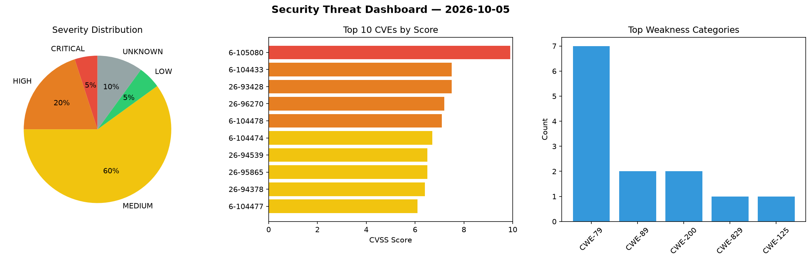
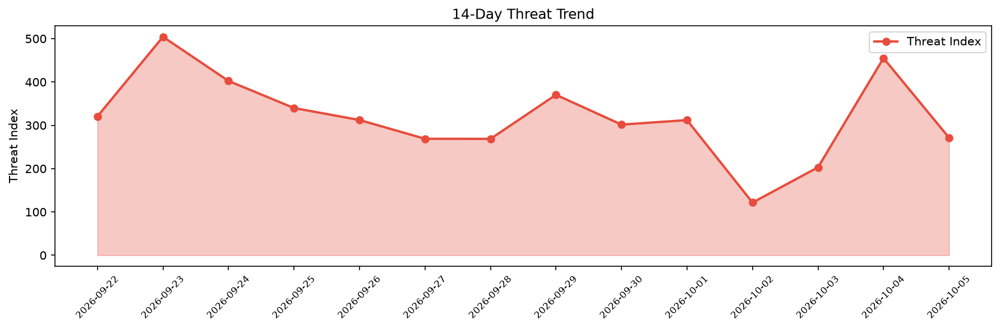

# Security Scan Report — 2026-10-05

**Scan ID:** `7d917e188a` | **CVEs:** 20 | **Threat Index:** 271.4

## Threat Overview

| Metric | Value |
|--------|-------|
| Threat Index | 271.4 |
| Critical CVEs | 1 |
| CRITICAL | 1 |
| HIGH | 4 |
| MEDIUM | 12 |
| LOW | 1 |
| UNKNOWN | 2 |

## Delta vs Yesterday

| Metric | Today | Yesterday | Change |
|--------|-------|-----------|--------|
| total_cves | 20 | 20 | ➡️ 0.0% |
| threat_index | 271.4 | 455.1 | 📉 -40.4% |
| critical_count | 1 | 6 | 📉 -83.3% |

## Top Weakness Categories

| CWE | Count |
|-----|-------|
| CWE-79 | 7 |
| CWE-89 | 2 |
| CWE-200 | 2 |
| CWE-829 | 1 |
| CWE-125 | 1 |

## CVE Details

| CVE ID | Score | Severity | Description |
|--------|-------|----------|-------------|
| CVE-2026-105080 | 9.9 | CRITICAL | In ConvertX before 0.19.0, converters/calibre.ts does not block recipe files, an... |
| CVE-2026-104433 | 7.5 | HIGH | Mooncake transfer engine before 0.3.12 contains an out-of-bounds read vulnerabil... |
| CVE-2026-93428 | 7.5 | HIGH | The Ultimate Member – User Profile, Registration, Login, Member Directory, Conte... |
| CVE-2026-96270 | 7.2 | HIGH | The Ultimate Member – User Profile, Registration, Login, Member Directory, Conte... |
| CVE-2026-104478 | 7.1 | HIGH | Formwork before 2.3.13 contains a path traversal vulnerability in BackupControll... |
| CVE-2026-104474 | 6.7 | MEDIUM | OpenLiteSpeed before 1.9.3 contains a local privilege escalation vulnerability i... |
| CVE-2026-94539 | 6.5 | MEDIUM | The SupportCandy – AI Customer Support Ticket System & Live Chatbot Agent plugin... |
| CVE-2026-95865 | 6.5 | MEDIUM | The Beaver Builder Page Builder – Drag and Drop Website Builder plugin for WordP... |
| CVE-2026-94378 | 6.4 | MEDIUM | The SupportCandy – AI Customer Support Ticket System & Live Chatbot Agent plugin... |
| CVE-2026-104477 | 6.1 | MEDIUM | Showdown through 2.1.0 contains a cross-site scripting vulnerability in the make... |
| CVE-2026-92243 | 6.1 | MEDIUM | The Ivory Search – WordPress Search Plugin plugin for WordPress is vulnerable to... |
| CVE-2026-104476 | 5.9 | MEDIUM | Backdrop CMS before 1.35.1 contains an information disclosure vulnerability that... |
| CVE-2026-104475 | 5.4 | MEDIUM | IDURAR ERP CRM through 4.1.1 contains a stored cross-site scripting vulnerabilit... |
| CVE-2026-104479 | 5.4 | MEDIUM | Shopclass before 6.2.0 contains a stored cross-site scripting vulnerability that... |
| CVE-2026-100180 | 5.4 | MEDIUM | The Jeg Kit for Elementor – Powerful Addons for Elementor, Widgets & Templates f... |