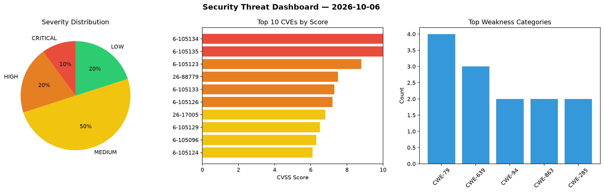
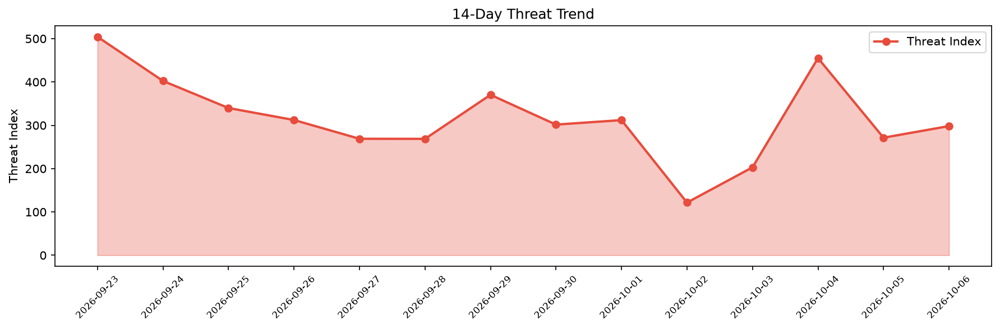

# Security Scan Report — 2026-10-06

**Scan ID:** `cf47592814` | **CVEs:** 20 | **Threat Index:** 298.2

## Threat Overview

| Metric | Value |
|--------|-------|
| Threat Index | 298.2 |
| Critical CVEs | 2 |
| CRITICAL | 2 |
| HIGH | 4 |
| MEDIUM | 10 |
| LOW | 4 |

## Delta vs Yesterday

| Metric | Today | Yesterday | Change |
|--------|-------|-----------|--------|
| total_cves | 20 | 20 | ➡️ 0.0% |
| threat_index | 298.2 | 271.4 | 📈 9.9% |
| critical_count | 2 | 1 | 📈 100.0% |

## Top Weakness Categories

| CWE | Count |
|-----|-------|
| CWE-79 | 4 |
| CWE-639 | 3 |
| CWE-94 | 2 |
| CWE-863 | 2 |
| CWE-285 | 2 |

## CVE Details

| CVE ID | Score | Severity | Description |
|--------|-------|----------|-------------|
| CVE-2026-105134 | 10.0 | CRITICAL | A flaw has been found in Ahsay AhsayCBS up to 10.3.2. This vulnerability affects... |
| CVE-2026-105135 | 10.0 | CRITICAL | A vulnerability has been found in InternLM MindSearch 0.1.0. This issue affects ... |
| CVE-2026-105123 | 8.8 | HIGH | W (vincent-peugnet/wcms) through 3.18.0 contains a remote code execution vulnera... |
| CVE-2026-88779 | 7.5 | HIGH | Vulnerability in NetScaler ADC and NetScaler Gateway.

This issue affects ADC: b... |
| CVE-2026-105133 | 7.3 | HIGH | A vulnerability was detected in Ahsay AhsayCBS up to 10.3.2. This affects the fu... |
| CVE-2026-105126 | 7.2 | HIGH | LaraDashboard before 1.4.8 contains an improper privilege management vulnerabili... |
| CVE-2026-17005 | 6.8 | MEDIUM | The Horizontal scrolling announcements WordPress plugin through 2.6 does not san... |
| CVE-2026-105129 | 6.5 | MEDIUM | LaraDashboard before 1.4.8 contains an incorrect authorization vulnerability tha... |
| CVE-2026-105096 | 6.3 | MEDIUM | A vulnerability was determined in Omega Solution CoinEx Crypto 2025. This affect... |
| CVE-2026-105124 | 6.1 | MEDIUM | W (vincent-peugnet/wcms) through 3.18.0 contains a stored cross-site scripting v... |
| CVE-2026-105128 | 5.4 | MEDIUM | LaraDashboard before 1.4.8 contains an open redirect vulnerability that allows r... |
| CVE-2026-105131 | 5.4 | MEDIUM | ezBookkeeping 1.2.0 before 2.0.1 contains a privilege escalation vulnerability t... |
| CVE-2026-105127 | 5.3 | MEDIUM | LaraDashboard 1.4.2 before 1.4.8 applies advanced email validation to unauthenti... |
| CVE-2026-104118 | 5.3 | MEDIUM | The Razorpay for WooCommerce WordPress plugin before 4.8.8 does not perform owne... |
| CVE-2026-105097 | 4.3 | MEDIUM | A vulnerability was identified in Omega Solution CoinEx Crypto 2025. This impact... |