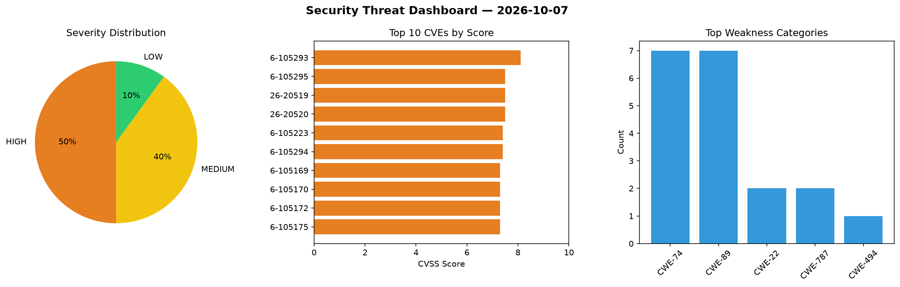
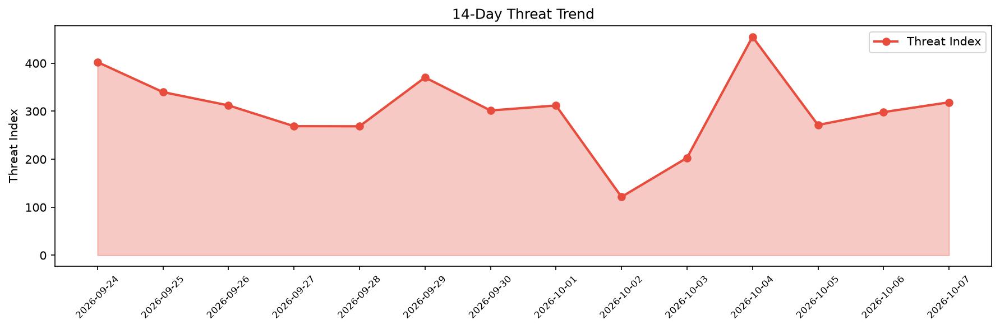

# Security Scan Report — 2026-10-07

**Scan ID:** `30cfb3a7c4` | **CVEs:** 20 | **Threat Index:** 318.6

## Threat Overview

| Metric | Value |
|--------|-------|
| Threat Index | 318.6 |
| Critical CVEs | 0 |
| HIGH | 10 |
| MEDIUM | 8 |
| LOW | 2 |

## Delta vs Yesterday

| Metric | Today | Yesterday | Change |
|--------|-------|-----------|--------|
| total_cves | 20 | 20 | ➡️ 0.0% |
| threat_index | 318.6 | 298.2 | 📈 6.8% |
| critical_count | 0 | 2 | 📉 -100.0% |

## Top Weakness Categories

| CWE | Count |
|-----|-------|
| CWE-74 | 7 |
| CWE-89 | 7 |
| CWE-22 | 2 |
| CWE-787 | 2 |
| CWE-494 | 1 |

## CVE Details

| CVE ID | Score | Severity | Description |
|--------|-------|----------|-------------|
| CVE-2026-105293 | 8.1 | HIGH | Legcord 1.1.0 through 1.3.0 contains a path traversal vulnerability in theme IPC... |
| CVE-2026-105295 | 7.5 | HIGH | GitAhead 2.5.0 through 2.7.1 contains an insecure update mechanism that installs... |
| CVE-2026-20519 | 7.5 | HIGH | In Modem, there is a possible out of bounds write due to a missing bounds check.... |
| CVE-2026-20520 | 7.5 | HIGH | In Modem, there is a possible out of bounds write due to a missing bounds check.... |
| CVE-2026-105223 | 7.4 | HIGH | maclof kubernetes-client 0.17.0 before 0.32.0 disables TLS certificate verificat... |
| CVE-2026-105294 | 7.4 | HIGH | Legcord 1.1.0 through 1.3.0 contains a configuration injection vulnerability tha... |
| CVE-2026-105169 | 7.3 | HIGH | A security flaw has been discovered in kishor-23 food-waste-management-system 41... |
| CVE-2026-105170 | 7.3 | HIGH | A weakness has been identified in kishor-23 food-waste-management-system 411989e... |
| CVE-2026-105172 | 7.3 | HIGH | A vulnerability was detected in itsourcecode Online Admission System 1.0. Affect... |
| CVE-2026-105175 | 7.3 | HIGH | A vulnerability was found in SourceCodester Drug Recommendation System 1.0. This... |
| CVE-2026-105168 | 6.3 | MEDIUM | A vulnerability was identified in kishor-23 food-waste-management-system 411989e... |
| CVE-2026-105171 | 6.3 | MEDIUM | A security vulnerability has been detected in kishor-23 food-waste-management-sy... |
| CVE-2026-105180 | 6.3 | MEDIUM | A vulnerability was determined in Jeebase 0.0.1. This vulnerability affects the ... |
| CVE-2026-105292 | 5.9 | MEDIUM | Chaterm before 0.12.1 contains a login cross-site request forgery vulnerability ... |
| CVE-2026-105174 | 5.4 | MEDIUM | A vulnerability has been found in Gerapy up to 0.9.13. This vulnerability affect... |