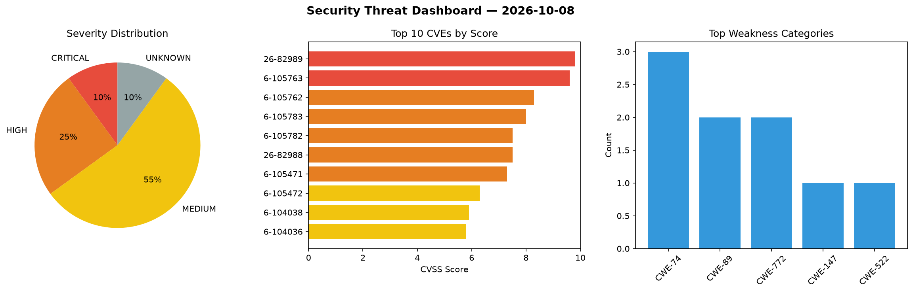
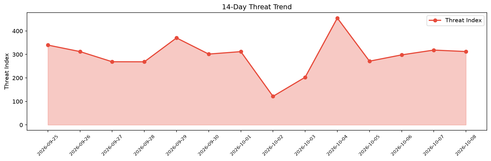

# Security Scan Report — 2026-10-08

**Scan ID:** `c4f9dc4795` | **CVEs:** 20 | **Threat Index:** 312.4

## Threat Overview

| Metric | Value |
|--------|-------|
| Threat Index | 312.4 |
| Critical CVEs | 2 |
| CRITICAL | 2 |
| HIGH | 5 |
| MEDIUM | 11 |
| UNKNOWN | 2 |

## Delta vs Yesterday

| Metric | Today | Yesterday | Change |
|--------|-------|-----------|--------|
| total_cves | 20 | 20 | ➡️ 0.0% |
| threat_index | 312.4 | 318.6 | 📉 -1.9% |
| critical_count | 2 | 0 | ➡️ 0% |

## Top Weakness Categories

| CWE | Count |
|-----|-------|
| CWE-74 | 3 |
| CWE-89 | 2 |
| CWE-772 | 2 |
| CWE-147 | 1 |
| CWE-522 | 1 |

## CVE Details

| CVE ID | Score | Severity | Description |
|--------|-------|----------|-------------|
| CVE-2026-82989 | 9.8 | CRITICAL | There is an input injection in vCast exposed network services in ViewSonic ViewB... |
| CVE-2026-105763 | 9.6 | CRITICAL | Twenty is an open-source CRM (customer relationship management) platform. From 1... |
| CVE-2026-105762 | 8.3 | HIGH | Dify is an open-source LLM app development platform. Prior to 1.13.0, the /conso... |
| CVE-2026-105783 | 8.0 | HIGH | Joplin is an open source note-taking and to-do application that organises notes ... |
| CVE-2026-105782 | 7.5 | HIGH | Scrapy is a high-level web crawling and scraping framework for Python. From 1.4.... |
| CVE-2026-82988 | 7.5 | HIGH | There exists an arbitrary file download in vCast APK delivery mechanism in ViewS... |
| CVE-2026-105471 | 7.3 | HIGH | A security flaw has been discovered in girishsaraf Online-Appointment-Booking-Sy... |
| CVE-2026-105472 | 6.3 | MEDIUM | A weakness has been identified in girishsaraf Online-Appointment-Booking-System ... |
| CVE-2026-104038 | 5.9 | MEDIUM | A flaw was found in sssd. A remote attacker can cause a denial of service (DoS) ... |
| CVE-2026-104036 | 5.8 | MEDIUM | A flaw was found in SSSD's NFS idmap plugin. When retrieving cached user or grou... |
| CVE-2026-104031 | 5.5 | MEDIUM | A flaw was found in SSSD. In configurations where the autofs responder service i... |
| CVE-2026-104032 | 5.5 | MEDIUM | A flaw was found in SSSD. An unprivileged local user can repeatedly request mast... |
| CVE-2026-104035 | 5.5 | MEDIUM | A flaw was found in SSSD. An issue in the Kerberos Credential Manager (KCM) resp... |
| CVE-2026-104037 | 5.5 | MEDIUM | A flaw was found in SSSD. A local attacker can exploit this issue by sending a s... |
| CVE-2026-104033 | 5.4 | MEDIUM | A flaw was found in SSSD. When configured to enforce account expiration using LD... |