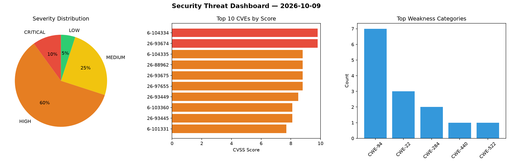
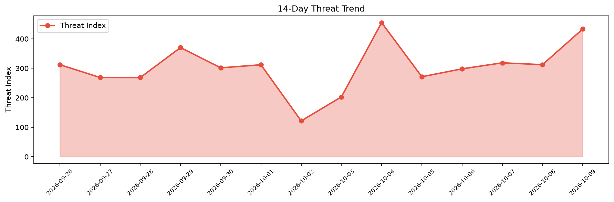

# Security Scan Report — 2026-10-09

**Scan ID:** `84843b4c1d` | **CVEs:** 20 | **Threat Index:** 433.2

## Threat Overview

| Metric | Value |
|--------|-------|
| Threat Index | 433.2 |
| Critical CVEs | 2 |
| CRITICAL | 2 |
| HIGH | 12 |
| MEDIUM | 5 |
| LOW | 1 |

## Delta vs Yesterday

| Metric | Today | Yesterday | Change |
|--------|-------|-----------|--------|
| total_cves | 20 | 20 | ➡️ 0.0% |
| threat_index | 433.2 | 312.4 | 📈 38.7% |
| critical_count | 2 | 2 | ➡️ 0.0% |

## Top Weakness Categories

| CWE | Count |
|-----|-------|
| CWE-94 | 7 |
| CWE-22 | 3 |
| CWE-284 | 2 |
| CWE-440 | 1 |
| CWE-522 | 1 |

## CVE Details

| CVE ID | Score | Severity | Description |
|--------|-------|----------|-------------|
| CVE-2026-104334 | 9.8 | CRITICAL | IBM Langflow OSS 1.0.0 through 1.12.2 could allow a remote attacker to execute a... |
| CVE-2026-93674 | 9.8 | CRITICAL | IBM Langflow OSS 1.0.0 through 1.12.2 could allow a remote attacker to execute a... |
| CVE-2026-104335 | 8.8 | HIGH | IBM Langflow OSS 1.0.0 through 1.12.2 could allow a remote authenticated attacke... |
| CVE-2026-88962 | 8.8 | HIGH | IBM Langflow OSS 1.0.0 through 1.12.2 could allow a remote authenticated attacke... |
| CVE-2026-93675 | 8.8 | HIGH | IBM Langflow OSS 1.0.0 through 1.12.2 could allow a remote attacker to execute a... |
| CVE-2026-97655 | 8.8 | HIGH | IBM Langflow OSS 1.0.0 through 1.12.2 could allow a remote attacker to execute a... |
| CVE-2026-93449 | 8.5 | HIGH | IBM Langflow OSS 1.0.0 through 1.12.2 could allow a remote authenticated attacke... |
| CVE-2026-103360 | 8.1 | HIGH | IBM Langflow OSS 1.0.0 through 1.12.2 could allow a remote authenticated attacke... |
| CVE-2026-93445 | 8.1 | HIGH | IBM Langflow OSS 1.0.0 through 1.12.2 could allow a remote authenticated attacke... |
| CVE-2026-101331 | 7.7 | HIGH | IBM Langflow OSS 1.0.0 through 1.12.2 could allow a remote authenticated attacke... |
| CVE-2026-93677 | 7.7 | HIGH | IBM Langflow OSS 1.0.0 through 1.12.2 could allow a remote authenticated attacke... |
| CVE-2026-93678 | 7.6 | HIGH | IBM Langflow OSS 1.0.0 through 1.12.2 could allow a remote authenticated attacke... |
| CVE-2026-93443 | 7.5 | HIGH | IBM Langflow OSS 1.0.0 through 1.12.2 could allow a remote authenticated attacke... |
| CVE-2026-93447 | 7.5 | HIGH | IBM Langflow OSS 1.0.0 through 1.12.2 could allow an attacker with access to the... |
| CVE-2026-101329 | 6.5 | MEDIUM | IBM Langflow OSS 1.0.0 through 1.12.2 could allow a remote authenticated attacke... |