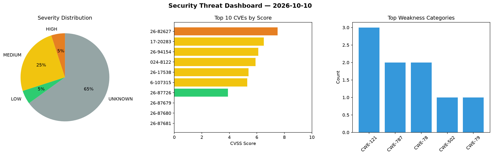
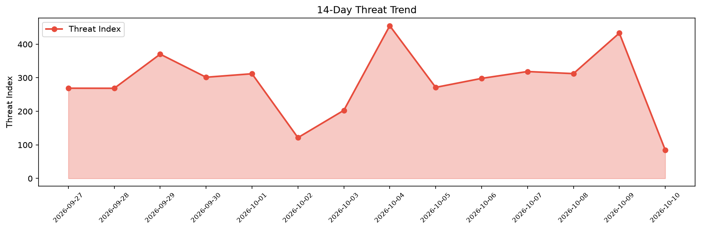

# Security Scan Report — 2026-10-10

**Scan ID:** `8310dbf914` | **CVEs:** 20 | **Threat Index:** 84.8

## Threat Overview

| Metric | Value |
|--------|-------|
| Threat Index | 84.8 |
| Critical CVEs | 0 |
| HIGH | 1 |
| MEDIUM | 5 |
| LOW | 1 |
| UNKNOWN | 13 |

## Delta vs Yesterday

| Metric | Today | Yesterday | Change |
|--------|-------|-----------|--------|
| total_cves | 20 | 20 | ➡️ 0.0% |
| threat_index | 84.8 | 433.2 | 📉 -80.4% |
| critical_count | 0 | 2 | 📉 -100.0% |

## Top Weakness Categories

| CWE | Count |
|-----|-------|
| CWE-121 | 3 |
| CWE-787 | 2 |
| CWE-78 | 2 |
| CWE-502 | 1 |
| CWE-79 | 1 |

## CVE Details

| CVE ID | Score | Severity | Description |
|--------|-------|----------|-------------|
| CVE-2026-82627 | 7.5 | HIGH | The Uncanny Automator – AI + Automation for WordPress / AI Agent, AI Page Builde... |
| CVE-2017-20283 | 6.5 | MEDIUM | NXP MQX Classic before 5.0 contains an out-of-bounds write vulnerability in the ... |
| CVE-2026-94154 | 6.1 | MEDIUM | The Aurora Heatmap plugin for WordPress is vulnerable to Stored Cross-Site Scrip... |
| CVE-2024-8122 | 5.9 | MEDIUM | The WSO2 Identity Server fails to enforce a default expiry time for SMS One-Time... |
| CVE-2026-17538 | 5.4 | MEDIUM | The LatePoint - Appointment Booking & Reservation plugin for WordPress is vulner... |
| CVE-2026-107315 | 5.3 | MEDIUM | pgjdbc, the PostgreSQL JDBC Driver, versions 42.7.4 through 42.7.13 pads a value... |
| CVE-2026-87726 | 3.9 | LOW | Insufficient API bounds checking in phalFelica in NXP NXPNfcRdLib RC663 through ... |
| CVE-2026-87679 | 0.0 | UNKNOWN | When Brocade Fabric OS versions before 10.0.1 processes trunk configuration oper... |
| CVE-2026-87680 | 0.0 | UNKNOWN | A command injection vulnerability in the REST API management interface of Brocad... |
| CVE-2026-87681 | 0.0 | UNKNOWN | An Access Control Bypass vulnerability exists in the Role-Based Access Control (... |
| CVE-2026-102488 | 0.0 | UNKNOWN | In affected versions, Octopus Server incorrectly evaluates multiple scoped permi... |
| CVE-2026-87682 | 0.0 | UNKNOWN | Multiple OS Command Injection vulnerabilities exist in the management interface ... |
| CVE-2026-87683 | 0.0 | UNKNOWN | Multiple stack-based buffer overflow vulnerabilities exist in the REST API manag... |
| CVE-2026-87659 | 0.0 | UNKNOWN | A critical authorization bypass vulnerability exists in the Management Server ha... |
| CVE-2026-87665 | 0.0 | UNKNOWN | A stack-based buffer overflow vulnerability exists in the Internet Key Exchange ... |